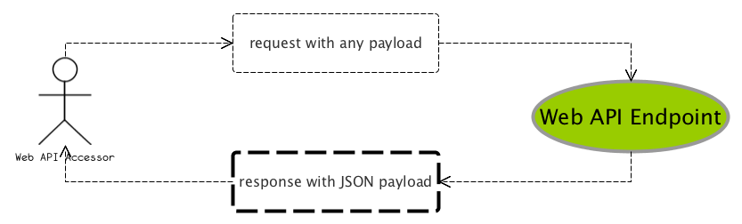

# 《SpringBoot揭秘》勘误项目

纸质出版因为牵扯的环节和周期相对较长，作者自身见解也难免偏颇，故此， 在本书出版之后，如果各位读者有疑问，建议，改进等反馈，可以在这个项目新建issue， 我会适时的选择给予答复， 当然，笔者个人难免时间和精力有限， 更希望大家可以通过issue展开讨论，互相切磋和解答疑问 ^_^

GL & HF :wink:

---

>>> :point_right: [Create New Issue Right Now !](https://github.com/fujohnwang/unveil-springboot-feedbacks/issues/new) 

---

# 第一版重点勘误(笔者自己做的全部勘误[看这里](勘误.md.html))

## 93页

插图5-2应该如下图所示， 可能是排版的时候稿件有问题导致：

