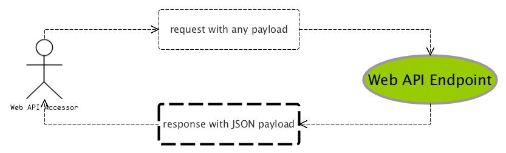

% 《SpringBoot揭秘》勘误列表
% 王福强 - fujohnwang AT gmail DOTA com
% 2016-05-24

# 页3

第三段， “从而负责不同功能的研发人员就可以..." ， 将开头的”从“删除， 变为”而负责不同功能的研发人员就可以...“

第四段， 

> 每一个功能或者少数相近的功能作为单一项目开发完成后将作为一个独立的服务单元进行交付

句式太长， 加逗号分割为：

> 每一个功能或者少数相近的功能作为单一项目开发完成后， 将作为一个独立的服务单元进行交付

# 页6

最后一段， ”（日本，国铁改革后也证明...)“， 中间没有逗号， 应该是“（日本国铁改革后也证明...）”

# 页12

插图应该如下：

而不是：

变成了两个都是DI

# 页14

> 基于JavaConfig方式的依赖关系绑定描述基本上映射了最早的基于XML的配置方式

句式太长，中间加逗号分割为：

> 基于JavaConfig方式的依赖关系绑定描述， 基本上映射了最早的基于XML的配置方式

# 页26

第三段， 

> 最“肤浅”的扩展或者配置是SpringApplication通过...

润色为：

> 最“肤浅”的扩展或者配置手段，要属SpringApplication通过一系列设置方法(setters)开放的定制方式

# 页30

> SpringApplicationRunListener是一个**只有**SpringBoot应用的main方法执行过程中接收不同执行时点事件通知的监听者

变更为：

> SpringApplicationRunListener是一个**只在**SpringBoot应用的main方法执行过程中接收不同执行时点事件通知的监听者

---

> 即使SpringBoot默认也只是实现了一个...

润色为：

> 即使是SpringBoot， 默认也只是实现了一个...

# 页32

第二段（列表项2）括号中的内容， 

> （以下代码是为SpringBoot默认注册的ApplicationListener配置）

多了一个“为”， 需要删掉：

> （以下代码是SpringBoot默认注册的ApplicationListener配置）

# 页39

> 	logging.config=/{some.path.you.defined}/any-logfile-name-I-like.log

变更为：

> 	logging.config=/{some.path.you.defined}/logback.xml

另外， “注意”部分的内容中， 

> `logging.file`和`logging.path`来自定义日志文件的名称和存放路径

润色为：

> `logging.file`和`logging.path`来自定义日志输出文件的名称和存放路径

# 页40

> 当前项目下运行`mvn spring-boot:run`就可以直接启动一个使用了嵌入式tomcat服务请求的web应用

润色为：

> 当前项目下运行`mvn spring-boot:run`， 就可以直接启动一个使用了嵌入式tomcat服务**web**请求的web应用

添加了逗号分隔，以及**服务请求** -> “**服务web请求**”

# 页47

> 就不单单是单一部署在应用启动的之前直接执行一次migration脚本那么简单了

润色为：

> 就不单单是单一部署**结点**在应用启动之前，直接执行一次migration脚本那么简单了

1. 添加了“结点”， 
2. 删除了“启动的之前”中的“**的**”， 
3. 添加了逗号分隔断句

# 页51

最后一段的注释中：

> 某个模板里面因为引用了某个公司的css资源，因未知原因可能导致页面加载缓慢，

润色为：

> 某个模板里面因为引用了某个**G**公司的css资源，因“未知原因”可能导致页面加载缓慢，

添加了“G”和“未知原因”的引号， 用于突出隐喻

# 页58

> 而安全确实非功能性需求

应该是：

> 而安全**却是**非功能性需求

---

> 零零散散点和线上落实的一些应用安全防护已经算很不错的了

润色为：

> 零零散散点能在线上落实一些应用安全防护已经算很不错的了

# 页59

>  我们到底应该是为了良好的扩展和组合**型**而将组件拆分的精细一些

“组合型”， 错别字， 应该是“组合**性**”

# 页74

第二个列表项中，`management.address=127.0.0.1`排版上缩进对齐一下更好， 比如对齐在方块儿的后面

# 页86

代码中， 

> private String domain = "com.wacai.lifecycles";

变更为：

> private String domain = "com.keevol.lifecycles";

# 页93

插图5-2配错了， 跟图5-1几乎一样，应该是下图：

# 页97

下面那部分代码跟上面是两段独立的代码， 

一个是中间加大分隔的空间，另一个是需要跟public对齐

# 页102

> @ComponentScan("com.wacai.springboot.webapi.errors")

改为：

> @ComponentScan("com.keevol.springboot.webapi.errors")

# 页123

> 外部化后的发布脚本将集中协调docker基础设施， 要发布的微服务上下文信息以及其它中间步骤

润色为：

> 外部化后的发布脚本，将集中协调docker基础设施以及要发布的微服务上下文信息和其它中间步骤

---

> 将微服务项目与docker挂钩的唯一纽带也仅仅是一个模板化、标注化后的Dockerfile

改为：

> 将微服务项目与docker挂钩的唯一纽带也仅仅是一个以模板化标准化后的Dockerfile

注意没有顿号

# 页126

> HTTP配合DNS或者DNS-SD或许是当下最有产品“范儿”的普适方案了

加逗号断句：

> HTTP配合DNS或者DNS-SD，或许是当下最有产品“范儿”的普适方案了

# 页140

“统一性设计”改为“**一致性的设计**”可能更好些

另外， 下图中缩进一个排版更贴切些：

i

# 页147

排版错位， Dash应该在下一行开头

# 页154

第一句，变为： 

> 如果将我们的spring-boot-starter-scala也加入进去，大家在创建项目的时候不就可以连pom.xml中的配置都不用写了吗？

这一句谁动过， 我原稿上不是印刷上那句话。

# 页155

> groupId: com.wacai.springboot

变为:

> groupId: com.keevol.springboot

# 页156

插图6-5替换为：

主要与第155页的变更相对应。

# 页175

"很多产品（...）只有一个打动..."这句原稿不是这么写的， 改后也不通顺， 在现在打印的版本上改， 将“只有”变为“只要有”更通顺些。

# 页184

> 起到了很好的抽象和防火墙效果

改为

> 起到了很好的抽象和防火墙的作用

# 页185

> 一颗临风玉树

错别字， 改为：

> 一棵临风玉树

